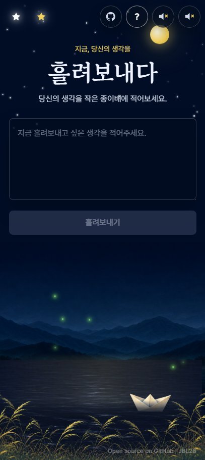

# Flow Boat

배포중: [https://roodev.me/](https://roodev.me/)

> 오늘 마음에 남은 생각을 작은 종이배에 적어, 밤의 강 위로 조용히 흘려보내는 웹 페이지입니다.


## 마음을 흘려보내는 작은 의식

Flow Boat는 기록보다 놓아주기에 가까운 공간입니다.  
걱정이나 생각을 입력하고 `흘려보내기`를 누르면, 문장은 종이배가 되어 강 위를 천천히 지나갑니다.

서버는 메시지를 오래 붙잡지 않습니다.  
지금 이 순간의 생각은 화면 위에서 잠시 머물다가, 물결과 함께 사라집니다.

## 주요 기능

### 종이배에 생각 담기

텍스트 영역에 떠오르는 생각을 적고 버튼을 누르면 종이배가 생성됩니다.  
같은 화면을 보고 있는 다른 사람에게도 WebSocket을 통해 배가 함께 흘러갑니다.

### 오늘 지나간 배

좌상단의 별 아이콘은 오늘 이 브라우저에서 흘려보낸 배의 개수를 보여줍니다.  
하루가 바뀌면 새로운 카운트로 다시 시작합니다.

### 소리와 분위기

우상단의 사운드 버튼으로 강의 엠비언스와 음악을 각각 켜고 끌 수 있습니다.  
화면은 한 뷰포트 안에 꽉 차도록 구성되어, 노트북과 모바일에서도 하단 여백 없이 하나의 장면처럼 보이도록 설계했습니다.

### 모바일 화면



## Open Source

Flow Boat는 오픈소스 프로젝트입니다.  
코드는 GitHub에서 확인할 수 있고, 화면 우상단의 GitHub 버튼을 통해 저장소로 이동할 수 있습니다.

---

## For Developers

### Tech Stack

- Frontend: React, Vite, Nginx
- Backend: Node.js, `ws`
- Runtime: Docker Compose
- Realtime: WebSocket endpoint proxied through `/ws`

### Repository Structure

```text
flow_boat/
├─ back/                      # WebSocket server
├─ front/                     # React/Vite frontend served by Nginx
├─ docs/                      # README screenshots
├─ docker-compose.yml         # image-based runtime services
├─ docker-compose.build.yml   # local build overlay
└─ docker-compose.local.yml   # local port overlay, 8080:80
```

### Run With Published Docker Images

Use this when you want to run the already-pushed Docker Hub images.

```bash
docker compose -f docker-compose.yml -f docker-compose.local.yml pull
docker compose -f docker-compose.yml -f docker-compose.local.yml up -d
```

Open:

```text
http://localhost:8080
```

Check status:

```bash
docker compose -f docker-compose.yml -f docker-compose.local.yml ps
```

Stop:

```bash
docker compose -f docker-compose.yml -f docker-compose.local.yml down
```

### Build And Run Locally

Use this when you changed source code and want Docker to rebuild the frontend/backend images locally.

```bash
docker compose -f docker-compose.yml -f docker-compose.build.yml build
docker compose -f docker-compose.yml -f docker-compose.build.yml -f docker-compose.local.yml up -d --force-recreate
```

### Frontend-Only Build Check

```bash
cd front
npm ci
npm run build
```

### Environment Variables

Copy `.env.example` to `.env` when you need custom image names or runtime settings.

```bash
cp .env.example .env
```

Common values:

- `DOCKER_IMAGE_BACKEND`: backend image name used by Compose
- `DOCKER_IMAGE_FRONTEND`: frontend image name used by Compose
- `ALLOWED_ORIGINS`: comma-separated WebSocket origin allowlist
- `VITE_WS_URL`: optional build-time WebSocket URL override

By default, the frontend derives the WebSocket URL from the current page origin and connects through `/ws`. Nginx proxies `/ws` to the backend container on port `3001`.

### Server Notes

The included `docker-compose.local.yml` exposes the frontend as `8080:80`.  
For a production server, create or edit a small override file to expose the frontend on the port your reverse proxy expects.

Example for direct port 80:

```yaml
services:
  frontend:
    ports:
      - "80:80"
```

Then run:

```bash
docker compose -f docker-compose.yml -f your-server-override.yml up -d
```

### Docker Images

Current default images in `docker-compose.yml`:

- `roodev0208/flow-frontend:latest`
- `roodev0208/flow-backend:latest`
